# uPicoWSensorNode

[](https://sonarcloud.io/summary/new_code?id=inboxidau_uPicoWSensorNode)

This project is designed to read data from sensors and transmit it to MQTT topics using Raspberry Pi Pico W micro controllers. The data is then integrated with [MQTTThing](https://github.com/arachnetech/homebridge-mqttthing), allowing seamless communication with [HomeBridge](https://github.com/homebridge/homebridge) devices operating on Raspberry Pi Zero machines.

```mermaid
graph LR
    subgraph RaspberryPiPicoW["Raspberry Pi PicoW"]
        A[Sensor Node] -->|read data| B[UPicoWSensorNode]
    end

    subgraph PiZero["Pi Zero"]
        B -->|post values over WiFi| D[MQTT] <--> |poll values| F
        subgraph HomeBridge["HomeBridge"]
            F[MQTTThing]
        end
        
    end

    style RaspberryPiPicoW fill:#333,stroke:#333,stroke-width:2px
    style PiZero fill:#333,stroke:#333,stroke-width:2px
    style HomeBridge fill:#444,stroke:#333,stroke-width:2px
```



 It has been built with flexibility in mind for re-purposing to use cases requiring a similar WiFi connectivity and sensor/device lifecycle.

It is much simpler to use than to explain but, here we go!

## Program structure

The structure of a uPicoWSensor node will be straight forward for those familiar with using micropython and object classes.

As an example I have included an AtmosphericSensorNode class, you can use this if appropriate but more than likely you will want to write a class for the sensor(s) you intend to use.

```mermaid
graph TD
    subgraph RaspberryPiPicoW["uPicoWSensor structure"]
        A[main.py] -->|instantiate a sensor node| B(AtmosphericSensorNode)
        B -->|inheriting from| C(UPicoWSensorNode)
        C -->|import| D(Sensor Libraries)
    end
    style RaspberryPiPicoW fill:#333,stroke:#333,stroke-width:2px

```



A **main.py** file is used to load the custom sensor node when the device powers up. It sets up out logging file and implements rudimentary restart logic with a configurable restart delay.
> NOTE: The project makes use of  [URollingAppenderLog](https://github.com/inboxidau/uRollingAppenderLog)

The custom sensor node file is likely going to be the file which you need to write for yourself, it will inherit all of the core functionally of a UPicoWSensorNode. In the included example, **AtmosphericSensorNode.py**, we perform some tasks specific to a [**PiicoDev_BME280**](https://core-electronics.com.au/guides/piicodev-atmospheric-sensor-bme280-raspberry-pi-guide/) sensor and leave the heavy lifting to **UPicoWSensorNode.py**

**UPicoWSensorNode.py** is responsible for the lifecycle of a sensor node. From loading up configuration values, maintaining WiFi connectivity, getting the network time, initializing sensors and managing the MQTT broker connection. Support for the [**Makerverse nano power hat**](https://core-electronics.com.au/makerverse-nano-power-timer-hat-for-raspberry-pi-pico.html) is provided.

## AtmosphericSensorNode.py

The AtmosphericSensorNode class intentionally simple, It is responsible for

- loading in class specific configuration values from the JSON config file
- importing the [**PiicoDev_BME280**](https://core-electronics.com.au/guides/piicodev-atmospheric-sensor-bme280-raspberry-pi-guide/) class and instantiating a sensor variable
- reading data from the sensor and converting it to the required format and unit of measurement
- posting the collected information onto MQTT

> You don't have to use MQTT, you could write your post functions to send to a API, write to file, or anywhere else that your device can access.

Using AtmosphericSensorNode well might require you to read up about inheritance and python classes. There are two ways that we make use of functions in the example.

1. The __init_ function calls out to the UPicoWSensorNode__init_ function first, and then performs some more work.

    ```python
        def __init__(self, log, config_path='AtmosphericSensorNode.json'):
            super().__init__(log, config_path)
            if self.config:
                self.MQTT_TOPIC_temperature = self.config.get('MQTT_TOPIC_temperature', '')
                self.MQTT_TOPIC_humidity = self.config.get('MQTT_TOPIC_humidity', '')
                self.MQTT_TOPIC_airPressure = self.config.get('MQTT_TOPIC_airPressure', '')
                self.log.log_message(f"{self.__class__.__name__} Config values applied", LogLevel.INFO)
            else:
                self.log.log_message(f"{self.__class__.__name__} Failed to load config file.", LogLevel.ERROR)
                
            self.log.log_message(f"{self.__class__.__name__} initialized.", LogLevel.DEBUG)
            
            from PiicoDev_BME280 import PiicoDev_BME280
            self.sensor = PiicoDev_BME280() # instantiate the sensor
    ```

2. The read_sensor_data and post_sensor_data functions replace their equivalent UPicoWSensorNode functions.

    ```python
        def read_sensor_data(self):
            try:
                self.log_message("read_sensor_data ", LogLevel.DEBUG)
                # obtain sensor data
                self.sensor_data["tempC"], self.sensor_data["presPa"], self.sensor_data["humRH"] = self.sensor.values() # read all data from the sensor
                self.sensor_data["pres_hPa"]= self.sensor_data["presPa"] / 100 # convert air pressure Pascals -> hPa (or mbar, if you prefer)
                self.log_message(f"{self.sensor_data['tempC']} °C  {self.sensor_data['pres_hPa']} hPa {self.
                sensor_data['humRH']} %RH", LogLevel.INFO)
            except Exception as e:
                self.log_message(f"ERROR: {self.__class__.__name__}.read_sensor_data() {str(e)}", LogLevel.ERROR)
            return None
    ```

## Project Setup

Setting up a uPicoWSensor node project is fairly straight forward but there are some assumptions

1. The device will be operating on a WiFi network and, you have the **SSID** and **password**
2. The collected information will be sent to an MQTT queue, you have **mqtt connection details** and **queue paths**
3. The library dependencies are met
    - lib/inboxidau/[rolling_appender_log](https://github.com/inboxidau/uRollingAppenderLog)
    - sensor libraries e.g. the AtmosphericSensorNode example makes use of  lib/
        - [PiicoDev_BME280](https://github.com/CoreElectronics/CE-PiicoDev-BME280-MicroPython-Module)
        - [PiicoDev_Unified.py](https://github.com/CoreElectronics/CE-PiicoDev-Unified)
    - micropython libraries in lib/umqtt
        - [umqtt.simple](https://github.com/micropython/micropython-lib/tree/master/micropython/umqtt.simple)
        - [umqtt.robust](https://github.com/micropython/micropython-lib/tree/master/micropython/umqtt.robust)

When dependencies are met then you then need to

1. Create your JSON config file and add all environmental key pairs e.g. **config.json** or **AtmosphericSensorNode.json**

    ```json
    {
    "WIFI_SSID": "test 2.4 Ghz SID",
    "WIFI_PASSWORD": "test WiFi Password",
    "MQTT_BROKER": "test homebridge.local",
    "MQTT_PORT": 8883,
    "MQTT_TOPIC_temperature": "test/weatherstn/piicodev_board/temperature",
    "MQTT_TOPIC_humidity": "test/weatherstn/piicodev_board/humidity",
    "MQTT_TOPIC_airPressure": "test/weatherstn/piicodev_board/airPressure",
    "MQTT_USERNAME": "test MQTT username",
    "MQTT_PASSWORD": "test MQTT password",
    "MQTT_CA_CERTS": "test MQTT.crt file",
    "LOG_SENSOR_DATA": 0,
    "MAKERVERSE_NANO_POWER_TIMER_HAT": 0
    }
    ```

    **NOTE:** SSL certificate support has not been tested as of this release.

2. Subclass UPicoWSensorNode like the AtmosphericSensorNode.py example

    ```python
        from pico_w_sensor_node import UPicoWSensorNode
        from rolling_appender_log import URollingAppenderLog, LogLevel

        class AtmosphericSensorNode(UPicoWSensorNode):

            STATIC_NODE_LOG_LEVEL = LogLevel.INFO       # Used to designate the log level required, normally LogLevel.INFO will suffice for a completed device

    ```

    - Write **def \_\_init\_\_(self, log, config_path='AtmosphericSensorNode.json'):** which
        - calls super()
        - loads in your project specific config
        - imports the sensor libraries and instantiates self.sensor
    - write **def read_sensor_data(self):** which
        - reads sensor data and processes into the appropriate collected data format
    - write **def post_sensor_data(self):** which
        - sends collected data to MQTT
3. Add imports to main.py for your new class and instantiate as myNode **using your selected config file name e.g. **config.json** or **AtmosphericSensorNode.json**
4. Configure the URollingAppenderLog values on the global variable **log**

## Installing onto a Raspberry [**Pi Pico W**](https://core-electronics.com.au/raspberry-pi/pico.html)

Installation is just a matter of downloading the project files, libraries and config file onto your device. I use the Thonny IDE to do this but there are other tools which support this.

When you have sensors and power connected then the pico will boot up and run ad infinitum as long as power is maintained and entropy held at bay.

There are a few static variable set in UPicoWSensorNode which can be overridden in your subclass if needed e.g. for AtmosphericSensorNode.m

```python
    def __init__(self, log, config_path='AtmosphericSensorNode.json'):
        super().__init__(log, config_path)
        self.STATIC_NODE_LOG_LEVEL = LogLevel.DEBUG      # Used to designate the log level required, normally LogLevel.INFO will suffice for a completed device
        self.STATIC_NODE_RESTART_DELAY = 60              # Used to delay restarting main() on an unhandled exception
        self.STATIC_NODE_SENSE_REPEAT_DELAY = 300        # Used to designate the delay in seconds between sensor reading

        self.STATIC_WIFI_MAX_RETRIES = 3                 # Used to determine how many time we retry to establish wi-fi connections
        self.STATIC_WIFI_RETRY_DELAY = 1                 # seconds
```

During familiarization and testing I recommend setting the log level to debug level to get the most out of the logging. It will give you a good view of the program life-cycle also detailing exception handling, sensor reads, posting to MQTT, sleeping, power up and power down if you have the hat.

```python
    STATIC_NODE_LOG_LEVEL = LogLevel.DEBUG
```

Your final deployed files will look something like:

```python
root
├── main.py
├── config.json
├── AtmosphericSensorNode.py
└── lib
    ├── PiicoDev_Unified.py
    ├── PiicoDev_BME280.py
    ├── inboxidau
    │   ├── pico_w_sensor_node.py
    │   └── rolling_appender_log.py
    └── umqtt
        ├── simple.py
        └── robust.py
```
